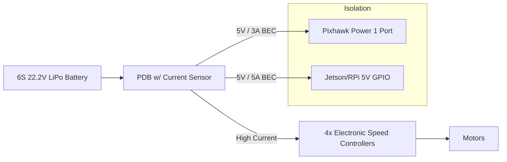
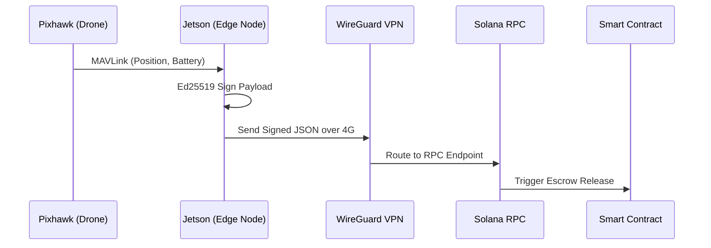

# NeuralAir Hardware Integration & Wiring Guide

This document provides detailed hardware schematics, wiring diagrams, and architectural layouts for building a physical NeuralAir edge node. It is designed to bridge the gap between our MAVLink software bridge and the physical drone.

---

## 1. Core Hardware Architecture

The physical drone requires two main computation brains working in tandem:

```mermaid
graph TD
    subgraph Edge Node (Companion Computer)
        J[NVIDIA Jetson Orin Nano / RPi 4]
        LTE[4G/5G LTE Hat]
        CAM[Camera Payload]
    end

    subgraph Flight Controller
        PX[Pixhawk 4 / Cube Orange]
        GPS[RTK GPS Module]
        ESC[ESC / Motors]
        RC[RC Receiver]
    end

    subgraph Power System
        BATT[LiPo/Li-Ion Battery]
        PDB[Power Distribution Board]
        BEC1[5V BEC - Flight Controller]
        BEC2[5V/12V BEC - Companion Computer]
    end

    BATT --> PDB
    PDB --> BEC1
    PDB --> BEC2
    PDB --> ESC
    
    BEC1 --> PX
    BEC2 --> J
    
    J -- TELEM2 (Serial RX/TX) --> PX
    J -- USB 3.0 --> LTE
    J -- CSI/USB --> CAM
    
    PX --> ESC
    PX --> GPS
    RC -. SBUS .-> PX
```

---

## 2. Pixhawk to Companion Computer Wiring (Telemetry)

To enable the `node_bridge.py` script to communicate with the flight controller via MAVLink, you must establish a serial connection between the Jetson/Raspberry Pi and the Pixhawk's `TELEM 2` port.

### Pinout Configuration

| Pixhawk (TELEM 2) | Wire Color (Typical) | Companion Computer (Jetson/RPi GPIO) |
| :--- | :--- | :--- |
| **Pin 1 (VCC 5V)** | Red | **DO NOT CONNECT** (Power separately via BEC) |
| **Pin 2 (TX)** | Blue / Yellow | **RX** (e.g., UART RX Pin 10) |
| **Pin 3 (RX)** | Green | **TX** (e.g., UART TX Pin 8) |
| **Pin 4 (CTS)** | - | Not required for basic telemetry |
| **Pin 5 (RTS)** | - | Not required for basic telemetry |
| **Pin 6 (GND)** | Black | **GND** (Any Ground Pin, e.g., Pin 6) |

> ⚠️ **CRITICAL WARNING:** Never power the Companion Computer directly from the Pixhawk's TELEM port. The Jetson/RPi draws too much current and will brown-out or damage the flight controller. Always use a dedicated BEC.

---

## 3. Power Distribution Diagram

A clean power supply is essential for autonomous missions. Voltage spikes from the motors (ESCs) can crash the edge computer.



### Component Selection
- **Battery:** 6S (22.2V) or 12S (44.4V) depending on frame size.
- **BEC (Companion):** Must support at least 5V / 5A continuous. Jetson Nano requires up to 4A under heavy AI load.
- **Power Module:** Use a Mauch Power Module or similar high-reliability current sensor to report accurate battery percentage back to the Solana Network.

---

## 4. LTE Module & Cloud Connection

The drone acts as a Solana edge node. It requires a persistent internet connection to listen for smart contract events and broadcast its signed telemetry.

### Hardware Setup
1. **LTE Hat:** Sixfab 4G/LTE Base HAT or Waveshare SIM7600 module connected to the Companion Computer via USB.
2. **Antennas:** Dual SMA antennas mounted vertically on the drone arms to prevent signal blockage by carbon fiber plates.

### Network Flow



---

## 5. Sky-Charge Pod Contact Interface

For the DePIN charging stations, the drone must land on a physical pad.

- **Drone Belly:** Two copper landing skids.
  - Skid 1: VCC (+)
  - Skid 2: GND (-)
  - *Optional Skid 3:* Data (1-Wire) for authentication handshake.
- **Charging Pod Pad:** Exposed conductive strips. When the drone lands, the circuit closes.
- **Flow:** The pod reads the drone's MAC/ID via the data pin, verifies the session with the NeuralAir protocol, and engages a relay to flow current into the LiPo BMS (Battery Management System).

---

## 6. Software Configuration for Hardware

Once wired, you must configure the Pixhawk parameters via QGroundControl to enable MAVLink on TELEM 2:

1. Connect to Pixhawk via USB.
2. Go to **Parameters > SERIAL2**.
3. Set `SERIAL2_PROTOCOL` to `2` (MAVLink 2).
4. Set `SERIAL2_BAUD` to `921` (921600 baud rate).
5. On the Jetson/RPi, ensure the serial port is free (disable serial console) and run:
   `python hardware-nodes/pixhawk-mavlink/node_bridge.py --port /dev/ttyTHS1 --baud 921600`
