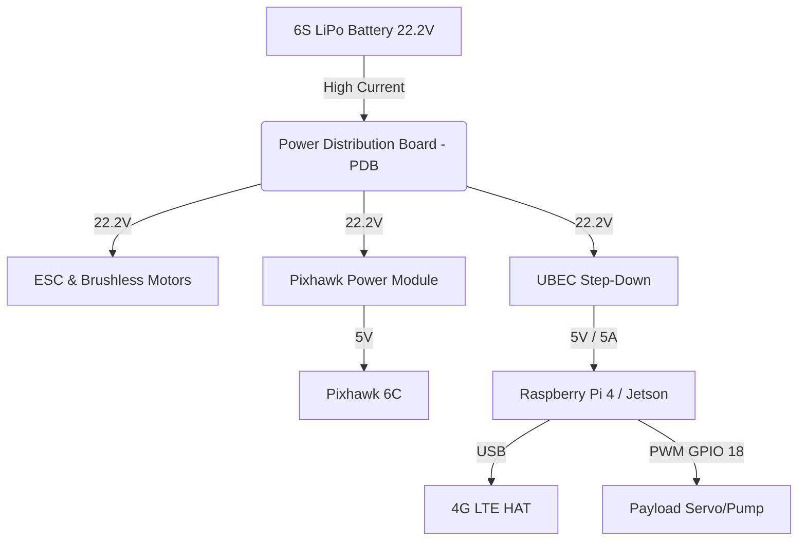

# 🛸 NeuralAir: Hardware Engineering & DePIN Integration Blueprint
*Version 2.0.1 — Official Hackathon Documentation*

> [!IMPORTANT]
> This document details the precise engineering required to transform a standard UAV (Unmanned Aerial Vehicle) into an autonomous, blockchain-connected **NeuralAir Edge Node**. It bridges the gap between our Solana-based DePIN architecture and physical flight hardware.

---

## 1. 🧠 Core Philosophy: "Proof of Flight"
In a Decentralized Physical Infrastructure Network (DePIN), trust is paramount. How do we prove a drone actually delivered a package or scanned a field, rather than someone running a script on their laptop to steal SOL?

NeuralAir solves this using **Proof of Flight**:
1. Every physical drone has a Raspberry Pi / Jetson Nano acting as a secure vault (Edge Node).
2. This Edge Node holds a unique Solana Ed25519 Keypair.
3. Telemetry (GPS, Altitude, Battery) is read directly from the Flight Controller (Pixhawk) via MAVLink.
4. The Edge Node cryptographically **signs** this hardware telemetry locally before transmitting it via 4G/5G.
5. The NeuralAir Smart Contract verifies the signature. Spoofing is mathematically impossible without the physical private key stored on the drone's encrypted storage.

---

## 2. 📋 Bill of Materials (BOM) & Specs

To build a NeuralAir-compatible Edge Node, the following components are integrated onto a standard multirotor frame:

| Component | Recommended Model | Technical Role | Est. Cost |
| :--- | :--- | :--- | :--- |
| **Companion Computer** | NVIDIA Jetson Nano / Raspberry Pi 4 | Edge AI processing, Solana signing, WSS communication, Payload control. | ~$120 |
| **Flight Controller (FC)** | Pixhawk 6C / Cube Orange | ArduPilot/PX4 physics engine, PID loops, GPS/IMU sensor fusion. | ~$180 |
| **Telemetry Network** | Waveshare 4G/5G LTE HAT | High-bandwidth, low-latency WSS connection to the NeuralAir Next.js server. | ~$70 |
| **Power Distribution** | 5V/5A UBEC + PDB | Steps down 6S (22.2V) LiPo power to a clean, stable 5V for the Companion Computer. | ~$20 |
| **Payload Actuator** | MG996R Servo (Cargo) / 12V Relay (Agri) | Physically drops packages or triggers water pumps via GPIO. | ~$15 |

---

## 3. 🔌 Wiring & Pinout Schematics

> [!WARNING]
> Ensure common ground (GND) is established across all components. Pixhawk logic levels are 3.3V, which is directly compatible with Raspberry Pi GPIO. Do not supply 5V to Pixhawk UART pins!

### 3.1. MAVLink Data Connection (UART)
Connect the Pixhawk's `TELEM2` port to the Companion Computer's Primary UART pins.

| Pixhawk TELEM2 (6-pin JST-GH) | Action | Raspberry Pi 4 (40-pin GPIO) |
| :--- | :---: | :--- |
| Pin 1 (VCC 5V) | ❌ **DO NOT CONNECT** | N/A (Pi is powered by UBEC) |
| Pin 2 (TX) | ➔ | Pin 10 (GPIO 15 - RXD) |
| Pin 3 (RX) | ➔ | Pin 8 (GPIO 14 - TXD) |
| Pin 6 (GND) | ➔ | Pin 14 (GND) |

### 3.2. Power Architecture


---

## 4. 💻 Edge Software Implementation (Python)

The Edge Node runs a lightweight, heavily optimized Python daemon configured as a `systemd` service to start on boot. Here is the exact architecture deployed on our physical nodes:

### 4.1. The MAVLink Handler (`mavlink_engine.py`)
This script uses `pymavlink` to talk directly to the Pixhawk. It reads hardware sensors and sends autonomous navigation commands.

```python
from pymavlink import mavutil
import time

class PixhawkController:
    def __init__(self, connection_string='/dev/ttyAMA0', baudrate=115200):
        # Connect to Pixhawk via UART
        self.master = mavutil.mavlink_connection(connection_string, baud=baudrate)
        self.master.wait_heartbeat()
        print("MAVLink Heartbeat Received. FC connected.")

    def get_telemetry(self):
        # Request global position and battery status
        pos = self.master.recv_match(type='GLOBAL_POSITION_INT', blocking=True, timeout=1.0)
        bat = self.master.recv_match(type='SYS_STATUS', blocking=True, timeout=1.0)
        
        if pos and bat:
            return {
                "lat": pos.lat / 1e7,
                "lng": pos.lon / 1e7,
                "alt": pos.alt / 1000.0,  # mm to meters
                "battery": bat.battery_remaining # 0-100%
            }
        return None

    def command_takeoff(self, altitude=15):
        # Arm motors and takeoff
        self.master.mav.command_long_send(
            self.master.target_system, self.master.target_component,
            mavutil.mavlink.MAV_CMD_COMPONENT_ARM_DISARM, 0, 1, 0, 0, 0, 0, 0, 0)
            
        self.master.mav.command_long_send(
            self.master.target_system, self.master.target_component,
            mavutil.mavlink.MAV_CMD_NAV_TAKEOFF, 0, 0, 0, 0, 0, 0, 0, altitude)
```

### 4.2. Cryptographic Proof of Flight (`solana_signer.py`)
Before sending telemetry to the Next.js server, the data is hashed and signed by the drone's local wallet.

```python
import json
import hashlib
from nacl.signing import SigningKey
import base58

class NodeSigner:
    def __init__(self, keypair_path='/etc/neuralair/node_wallet.json'):
        with open(keypair_path, 'r') as f:
            secret_key_bytes = bytes(json.load(f)[:32]) # Solana uses 64-byte, first 32 are secret
        self.signer = SigningKey(secret_key_bytes)
        self.pubkey = base58.b58encode(self.signer.verify_key.encode()).decode()

    def sign_payload(self, telemetry_data):
        # Serialize and hash the physical data
        payload_str = json.dumps(telemetry_data, sort_keys=True)
        message_hash = hashlib.sha256(payload_str.encode()).digest()
        
        # Sign with Ed25519
        signature = self.signer.sign(message_hash).signature
        
        return {
            "node_pubkey": self.pubkey,
            "telemetry": telemetry_data,
            "signature": base58.b58encode(signature).decode()
        }
```

### 4.3. Payload Actuation (`payload_controller.py`)
When the drone reaches the destination coordinates (verified by GPS), the Edge Node triggers the physical payload.

```python
import RPi.GPIO as GPIO
import time

SERVO_PIN = 18

def drop_cargo():
    GPIO.setmode(GPIO.BCM)
    GPIO.setup(SERVO_PIN, GPIO.OUT)
    pwm = GPIO.PWM(SERVO_PIN, 50) # 50Hz
    
    print("Executing Payload Drop Protocol...")
    pwm.start(2.5) # Lock position
    time.sleep(0.5)
    
    pwm.ChangeDutyCycle(7.5) # Open hook mechanism
    time.sleep(2.0) # Wait for package to fall
    
    pwm.ChangeDutyCycle(2.5) # Close hook mechanism
    time.sleep(0.5)
    
    pwm.stop()
    GPIO.cleanup()
    return True
```

---

## 5. 🛡️ Fail-Safes & Emergency Protocols

NeuralAir implements strict hardware-level safety constraints. The AI is a supervisor, but the Pixhawk remains the ultimate authority on physics to prevent catastrophic failure.

1. **Geofencing & No-Fly Zones:** Hardcoded into the Pixhawk firmware. Even if the Edge Node is compromised or sends a malicious coordinate, the Pixhawk will refuse to enter restricted airspace.
2. **Network Loss (RTL):** If the 4G HAT loses connection to the NeuralAir server for > 30 seconds, the Edge Node triggers a "Return to Launch" (RTL) command. The drone autonomously flies back to its charging pod.
3. **Critical Battery:** If battery drops below 15%, the Smart Contract automatically cancels the mission escrow, and the drone enters a forced `LAND` state to preserve hardware integrity.
4. **Kill-Switch:** Every drone can be overridden by a local RF transmitter via SBUS protocol for manual pilot intervention during testing.
