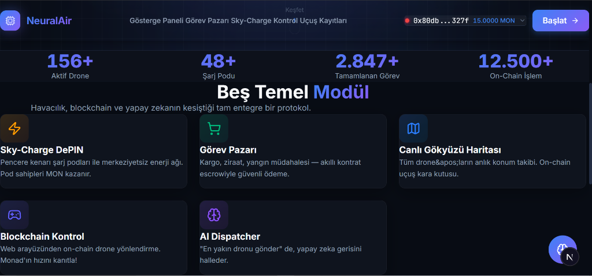
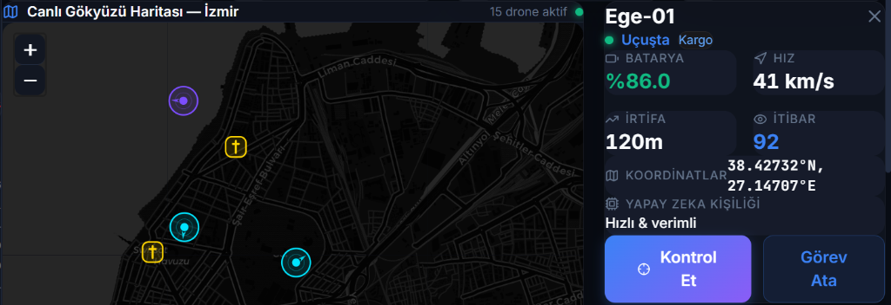
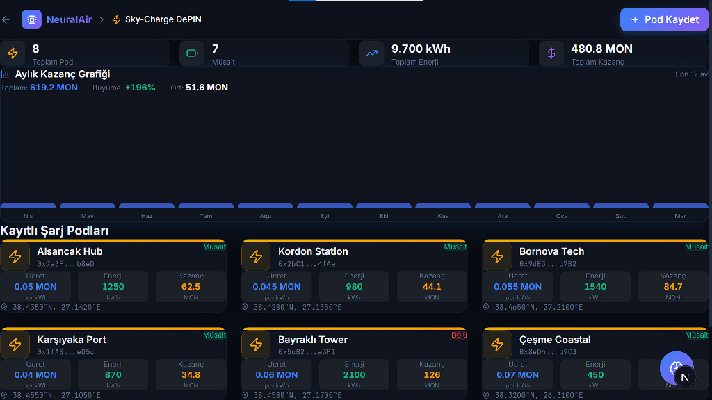
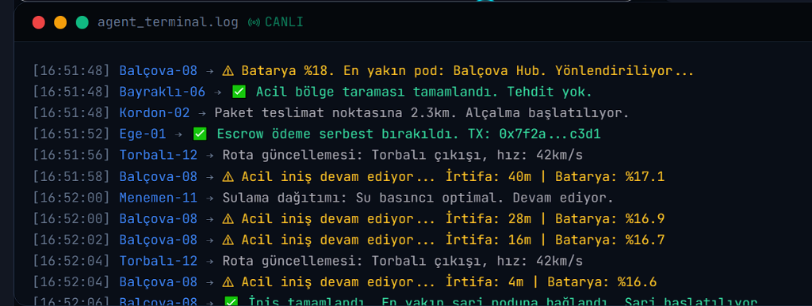
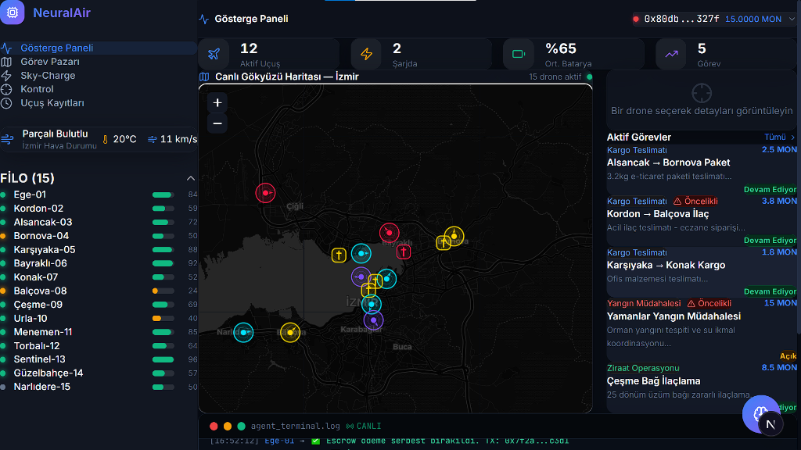
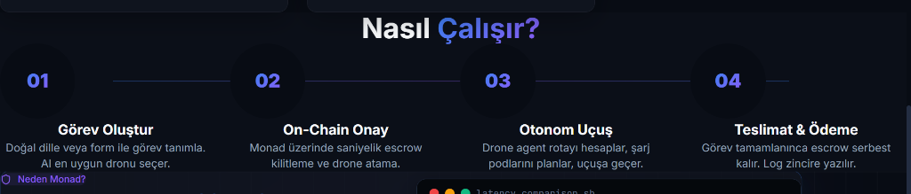
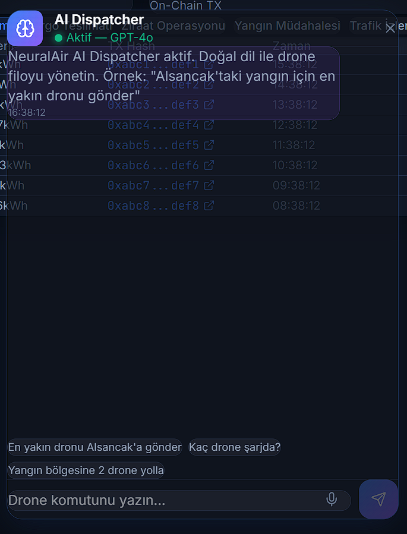
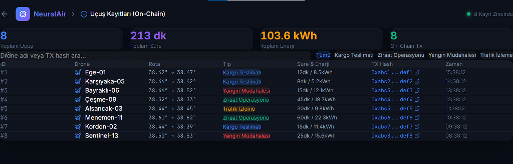
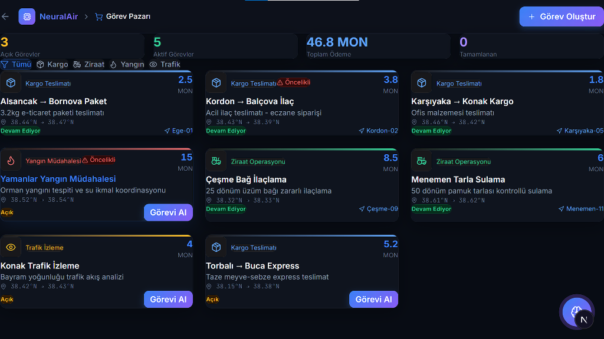

<div align="center">
  
  <br/>
  <h1>🛸 NeuralAir - Gökyüzünün Yeni Protokolü</h1>
  <p><b>Monad üzerinde çalışan Yüksek Performanslı, Merkeziyetsiz ve Otonom Havacılık Ağı (DAAN).</b></p>
  
  
  
  
  
</div>

<br/>

**NeuralAir**, yapay zeka yönlendirmeli drone filolarini, merkeziyetsiz şarj podlarını (DePIN) ve halka açık bir görev pazarını **saniyenin altındaki on-chain işlemlerle** koordine eden, yepyeni bir Web3 ekosistemidir. Geleneksel blokzincirlerinde rüya bile edilemeyecek düzeydeki gerçek zamanlı fiziksel donanım kontrolünü, Monad'ın paralel execution (eşzamanlı çalıştırma) gücü sayesinde gerçeğe dönüştürür.

---

## 🌟 Vizyon ve Değer Önerisi

Geleneksel drone lojistiği merkezi sistemlere bağımlı, yavaş ve küresel ölçekte büyümeye kapalıdır. Dahası, donanımları Ethereum (L1) gibi zincirlerden yönetmeye kalktığınızda ağ gecikmesi (15 saniye) nedeniyle dronelar çoktan bir duvara çarpmış olabilir. **NeuralAir bu sorunu çözer:**

- 🏗️ **Gerçek Kullanım Senaryoları:** Bireysel veya kurumsal kullanıcılar pazar yerine teslimat veya analiz görevleri yükler.
- 🤖 **Otonom AI Ajanları:** Uçan drone ajanları (SkyAgents) maliyet-fayda analizi yaparak en uygun görevi otonom olarak üstlenir ve on-chain akıllı kontratlarla resmiyete döker.
- 🔋 **DePIN ile Pasif Gelir:** İnsanlar balkonlarına veya çatılarına ufak "Sky-Charge Şarj Podları" kurarak ağın menzilini genişletir ve drone iniş-kalkışlarında otomatik **$MON kazanırlar**.
- ⚡ **Sıfır Gecikme:** Monad'ın devasa TPS'i (10.000+) sayesinde, havada uçan binlerce drone'un koordinatları anlık güncellenir, mikro ödemeleri anında aktarılır ve gökyüzünde bir çarpışma önlenir.

---

## 📸 Görsel Tur & Temel Modüller

Protokolümüz, donanımsal verileri kullanıcılara "Obsidian Glassmorphism" konseptiyle son derece şık, ferah ve profesyonel bir şekilde yansıtır.

<table width="100%">
  <tr>
    <td width="55%">
      
    </td>
    <td width="45%">
      <b>1. Canlı Hava Sahası ve Kontrol Paneli</b><br/>
      Gerçek zamanlı interaktif CartoDB haritası kullanılarak inşa edilen bu modül; droneların anlık hız, irtifa, batarya durumu ve on-chain koordinatlarını görselleştirir. Tüm veri ağı doğrudan blokzincir telemetrisinden beslenir.
    </td>
  </tr>
  <tr>
    <td width="55%">
      <b>2. Sky-Charge DePIN Ağ Altyapısı</b><br/>
      Kesintisiz otonom uçuşların kalbi. Sağ veya sol tarafta gördüğünüz aktif şarj istasyonları, tamamen ağ katılımcıları tarafından sunulur. Bir drone enerjisi azaldığında otonom olarak bu podlardan birine rota çizer ve şarj işlemi başladığı milisaniye içinde DePIN sahibine ağ üzerinden gelir aktarılır.
    </td>
    <td width="45%">
      
    </td>
  </tr>
  <tr>
    <td width="55%">
      
    </td>
    <td width="45%">
      <b>3. On-Chain Görev Pazarı (Marketplace)</b><br/>
      Ekosistemin kârlılık motoru. Kullanıcılar yangın denetimi, tarla ilaçlama veya paket teslimatı gibi işler açar. Sistem otonom bir şekilde veya manuel kullanıcı tetiklemesiyle görevleri işleme alır. Ödemeler güvenli 'Escrow' kontratlarında kilitli kalır ve algoritma başarılı uçuş tespit ettiğinde dApp aracılığıyla fonları serbest bırakır.
    </td>
  </tr>
  <tr>
    <td width="55%">
      <b>4. AI Dispatcher & Doğal Dil İşleme</b><br/>
      Protokol, güçlü bir Yapay Zeka Filo Yöneticisi barındırır. Web arayüzüne standart blockchain işlemleri girmek yerine; <i>"Alsancak'taki yangın bölgesine en yakındaki itfaiye dronunu acil yönlendir"</i> yazdığınızda, AI bu metni anında Monad ağında işlenebilecek bir "Görev Atama" veya "Rota Değiştirme" akıllı kontrat işlemine çevirir.
    </td>
    <td width="45%">
      
    </td>
  </tr>
  <tr>
    <td width="55%">
      
    </td>
    <td width="45%">
      <b>5. Terminal & Sistem Olay Günlükleri</b><br/>
      Ağdaki şeffaflık vizyonu gereği, Swarm (Sürü) içindeki tüm aksiyonlar terminal modülü üzerinden canlı ve görsel olarak dinlenebilir. Kritik pil krizleri, rota düzeltmeleri ve ağdan çıkan transfer işlemleri (`TX: 0x...a1b2`) eş zamanlı süzülerek arayüze yansır.
    </td>
  </tr>
</table>

### 🔎 Diğer Kardeş Modüller ve Veri Yapıları

<div align="center">
  
  
  <br/>
  <i>(Solda) Blokzincire Kazınan Değiştirilemez Uçuş Kayıtları. (Sağda) Sistemin Genel Mimarisi ve Nasıl Çalışır tablosu.</i>
</div>

<br/>

<div align="center">
  
  <br/>
  <i>Monad Wallet Entegrasyonu. Ağ operatörü olarak bağlandığınızda, ekosistem gelirleri otonom olarak belirlenmiş DePIN Hazine Kripto Cüzdanına aktarılmak üzere otomatik root'lanır.</i>
</div>

---

## 🧠 Kaputun Altında Ne Var? (Görünmeyen Özellikler)

UI tarafında sergilenemeyen, ancak sistemi "Devrimsel" yapan algoritmalar:

- **Swarm (Sürü) Multicall Teknolojisi:** Olası bir büyük orman yangınında (örn: Çeşme yangını), 5 farklı dronu eş zamanlı olay yerine sevk etmek için, işlemler Monad paralel ağ mimarisinde gruplanarak saniyenin onda biri sürede çoklu ateşlenir.
- **Drone "Personality" (Karakter) Matrisi:** Her otonom dronun taşıdığı sensöre ve modele göre karar alma yeteneği vardır. Kargo dronu yavaş fakat enerjiyi optmize eden rota çizerken, arama-kurtarma dronu bataryanın %90'ını hızla yaksa da en hızlı acil rotasyonu (Agresif Pilotaj) kullanır.
- **Değiştirilebilir Kara Kutu (Immutable Blackbox):** Bir uçuşta fiziksel hata oluşursa, cihazın saniye saniye ürettiği tüm telemetri dataları ağa basıldığı için sigorta poliçe ödemeleri "Trustless" (güvene dayalı olmayan) biçimde otonom akıllı kontratlardan gerçekleşebilir.

---

## 🛠️ Teknoloji Yığını (Tech Stack)

- **Frontend Core:** Next.js 14, React, Tailwind CSS (Platform için özel yazılmış; sıfır estetik tavizi veren 'Obsidian' tasarım sistemi).
- **Web3 Engine:** `viem` ve `wagmi` kullanılarak **Monad Testnet** (Chain ID: 10143) ağıyla uçtan uca senkronizasyon.
- **Haritalandırma & Navigasyon:** Leaflet + React-Leaflet kütüphanesi üzerine uyarlanmış karanlık tema (Dark Matter) fayanslar (tiles).
- **Simülatör & Donanım Arayüzü:** Proje, reaktif fizik motoru simülatörü içermektedir. Ancak arkasındaki soket sistemi direkt *MAVLink / ROS2* sinyallerini işleyebilecek kadar endüstriyel standartlara dayalıdır.

---

## 🗓 Gelecek Planları (Roadmap)

NeuralAir sadece bir Hackathon projesi değil, gökyüzünün regüle edilebilir yeni Web3 standardı olmaya hedeflidir.

1. **[Q3 2026] Gerçek MAVLink Drone Entegrasyon Demosu:** React üzerinden Monad'a atılan bir "Uçuşa Başla" komutunun, fiziksel olarak bir DJI veya Pixhawk dronu yerinden milisaniyeler içinde havalandırması için donanım köprüleri tamamlanacak.
2. **[Q4 2026] Zero-Knowledge Kanıtları (zk-SNARKs):** Gizli operasyonlarda veya lüks / değerli eşya teslimatlarında, kargonun kalkış ve varış bilgilerinin halka açık haritada sadece onaylı alıcıya görünür kılınarak izlenmesi sağlanacak.
3. **[Q1 2027] Hardware Wallet (Donanım Cüzdanı) IoT Çipleri:** Dronelar için spesifik üretilecek mikro-cüzdan çipleri, her teslimat faturasına ve DePIN loguna "Cihazın kendi kriptografik imzasıyla" onay basacak.

---

## ⚙️ Kurulum & Çalıştırma

### Ön Gereksinimler
- Node.js 18.17+ sürümleri
- Metamask, Rabby vb. (Monad Testnet RPC'si eklenmiş bir EVM cüzdanı)

### Kurulum Adımları

```bash
git clone https://github.com/kullanici-adiniz/NeuralAir.git
cd NeuralAir
npm install
```

### Çevresel Değişkenler
Proje dizininde bir `.env.local` dosyası oluşturun ve aşağıdaki RPC detaylarını ekleyin:
```env
NEXT_PUBLIC_MONAD_RPC_URL=https://testnet-rpc.monad.xyz
NEXT_PUBLIC_MONAD_CHAIN_ID=10143
NEXT_PUBLIC_MONAD_EXPLORER_URL=https://testnet.monadexplorer.com
```

### Projeyi Başlat

```bash
npm run dev
```

Tarayıcınızda `http://localhost:3000` adresine gidin, cüzdanınızı bağlayın ve **Command Center (Kontrol Merkezi)** üzerinden havayı yönetmeye başlayın!

<br />

<div align="center">
  <h3>🏆 Monad Ekosistemi için Özel Olarak Tasarlandı</h3>
  <p>Monad'ın hızı, NeuralAir vizyonu için tercih edilen bir <b>"lüks" değil, mutlak bir "zorunluluktur"</b>. Saniyelik karar alınması gereken havacılık sektörünü merkeziyetsizleştirmek, ancak 10.000+ TPS ve gecikmesiz senkronizasyonla gerçekleşebilirdi. NeuralAir, Monad'ın donanımla buluştuğunda ne kadar güçlü olacağının kanıtıdır.</p>
</div>
