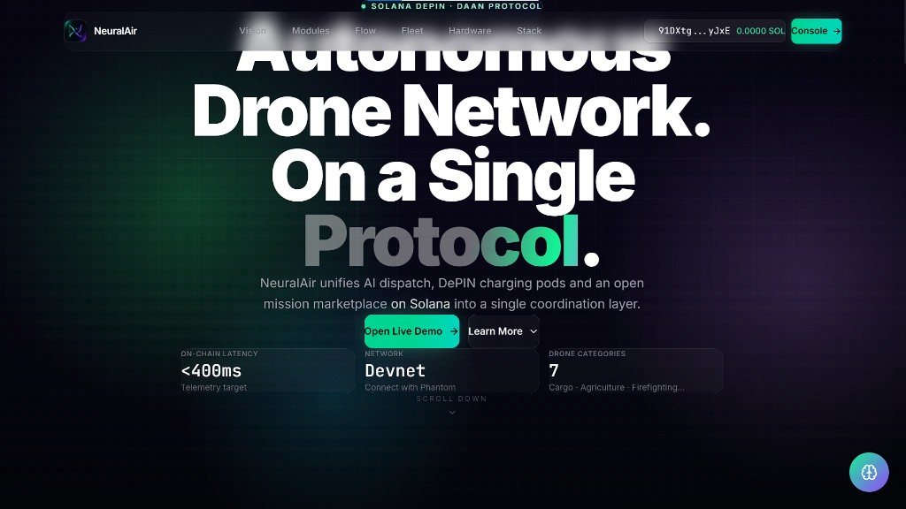
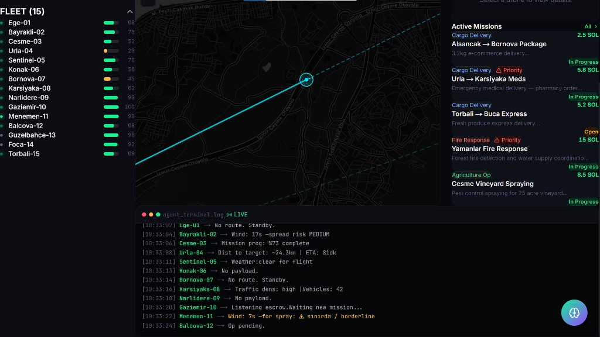
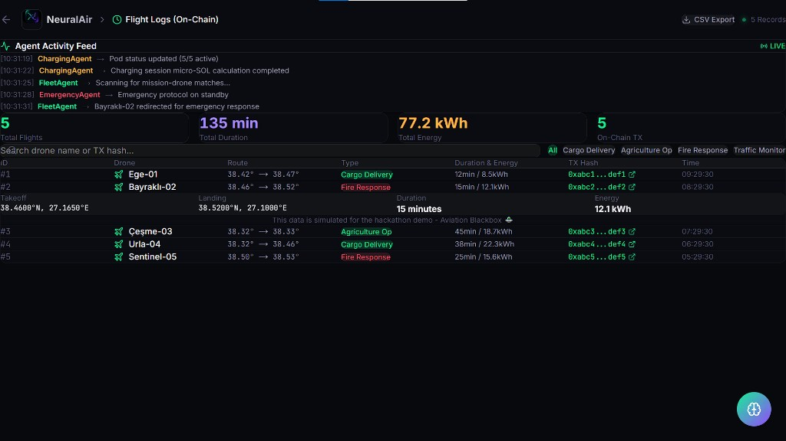
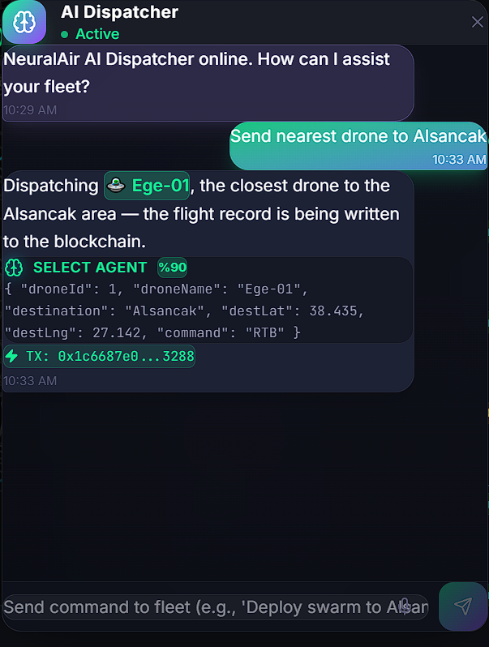
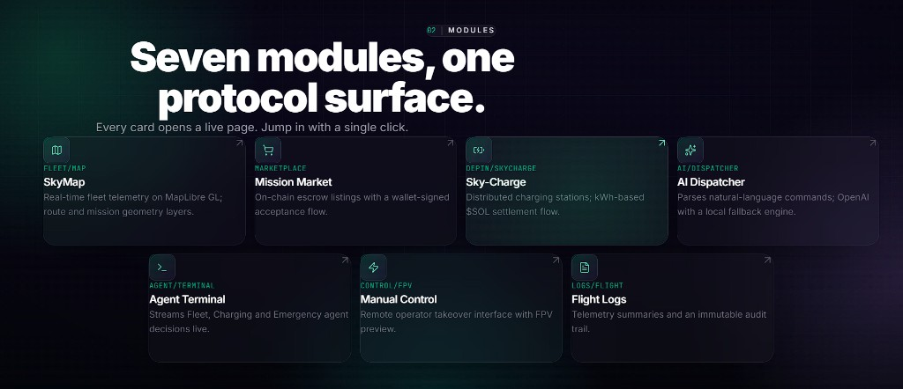
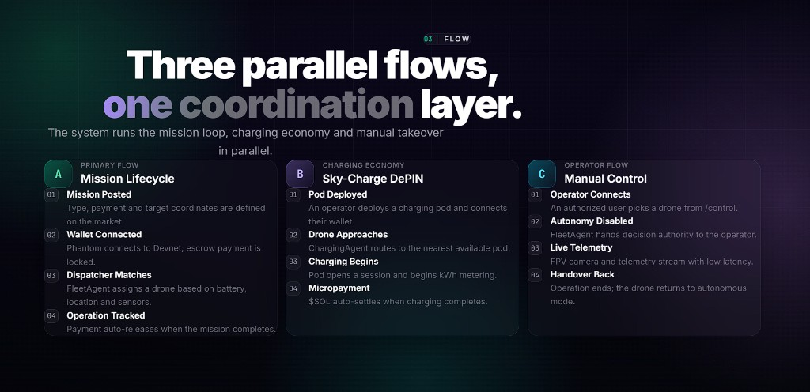
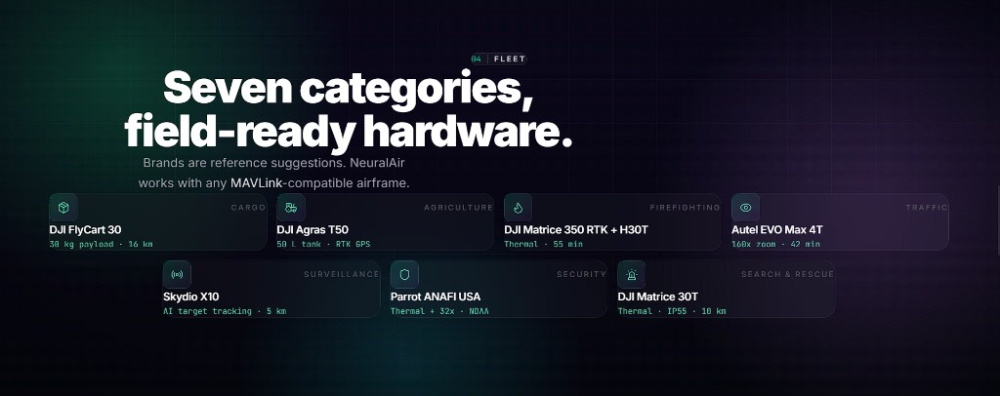
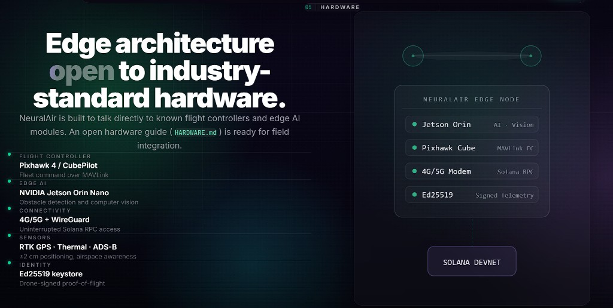
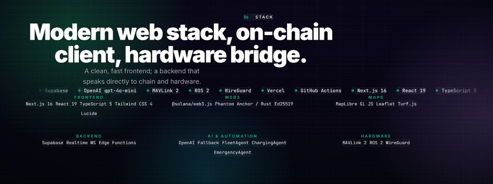

<div align="center">
  
  <h1>NeuralAir</h1>
  <p><strong>Decentralized Autonomous Aviation Network (DAAN) on Solana</strong> — open mission marketplace, live fleet intelligence, AI dispatch &amp; agents, and DePIN-style Sky-Charge economics.</p>
  <p>
    <a href="https://neuralair.vercel.app"></a>
    &nbsp;
    <a href="https://github.com/hsankc/NeuralAir"></a>
  </p>
  <p>
    
    
    
    
    
  </p>
</div>

---

## Overview

**NeuralAir** is a **product-grade hackathon build** that demonstrates how Solana can sit at the coordination layer for real-world drone operations: **missions**, **fleet telemetry**, **operator workflows**, and **charging infrastructure incentives**—without hiding behind abstract token narratives.

| Capability | What judges can click |
|------------|----------------------|
| **Open marketplace** | Post / browse missions (cargo, agriculture, fire, traffic) with wallet-aware UX on **Devnet** |
| **Live operations** | Interactive **MapLibre / Leaflet** map: drones, routes, filters, radar-style overlays |
| **AI coordination** | Natural-language **dispatcher** + streaming **Fleet / Charging / Emergency** agent reasoning (OpenAI with local fallback) |
| **DePIN slice** | **Sky-Charge** UI for distributed charging pods, energy & earnings storytelling |
| **Traceability** | **Flight logs** view for operational audit narrative |
| **Control surface** | **Manual control** page for pilot-style intervention story |

> **Simulation disclosure (important):** drone motion and some mission flows are **simulated** for a reliable jury demo. Wallet flows and UI are real where configured; the architecture is intentionally aligned with **MAVLink-class** integration paths for future field hardware.

---

## Route map (every screen in the app)

| Where | Path | What you use it for |
|-------|------|---------------------|
| **Landing** | `/` | Product story, scroll sections (Vision → Stack), wallet in header, **Open Live Demo** / **Console →** to enter the app |
| **Dashboard** | `/dashboard` | Live map, KPIs, fleet list, weather, missions, per-drone panel, agent terminal, floating **AI Dispatcher** |
| **Marketplace** | `/marketplace` | Browse / filter missions, **create mission** (modal + map pick), wallet-funded demo transfer to escrow address |
| **Sky-Charge** | `/sky-charge` | DePIN pods, live charging sessions, micro-SOL ticker, monthly chart, **Register Pod** flow |
| **Control (Sky-Sync)** | `/control` | Full-screen MapLibre **3D** city, FPV HUD, keyboard flight, **Solana TX stream** panel, drone switcher |
| **Flight logs** | `/flight-logs` | KPI strip, **Agent Activity Feed**, searchable table, type filters, row expand, **CSV export** |

Sidebar on dashboard mirrors the same destinations (Dashboard, Marketplace, Sky-Charge, Control Panel, Flight Logs).

---

## Recommended walkthrough (first 10 minutes)

1. Open **`/`** — skim hero metrics (latency target, Devnet, categories). Use top anchors (**Vision … Stack**) or scroll the page to see the full narrative.
2. Click **Console →** or **Open Live Demo** — lands on **`/dashboard`**. Wait for the short “Synchronizing fleet” boot sequence.
3. On the dashboard: watch **NetworkStats** (active flights, charging count, average battery, completed missions). Toggle **Radar Mode**, change **All Fleet** filter, click markers on **Live Operation Map** to select a drone.
4. With a drone selected: open **Info / Preflight / Chat** tabs in the right panel; in **Chat**, ask natural-language questions (optional `OPENAI_API_KEY`; otherwise fallback replies). Use **Assign Mission** / **Control** shortcuts when shown.
5. Open **Marketplace** — filter by mission type, open **Create Mission**, fill title/description/SOL price/coordinates (or use the map), connect **Phantom** on Devnet to run the demo transaction path.
6. Open **Sky-Charge** — observe live session progress bars, **ChargingAgent** log, aggregate kWh / SOL storytelling, bar chart, pod registry list.
7. Open **Control Panel** — click **START FLIGHT**, then use **W A S D**, **Q E** yaw, **Space / Shift** altitude. Toggle **SPORT / CINEMATIC** in the footer; watch **STREAMED TX** and the **SOLANA TX STREAM** panel.
8. Open **Flight Logs** — use search + type chips, expand a row for coordinates and energy, skim **Agent Activity Feed**, try **CSV Export**.
9. From any dashboard-class view, open the floating **brain** button — **AI Dispatcher**: try example phrases (e.g. “Send nearest drone to Alsancak”); inspect JSON intent and demo TX line when the parser fires.

---

## Visual guide (each screenshot explained)

Below, every image sits **beside** a structured reference: what you are looking at, how to drive it in the live app, and which UI blocks matter for demos or extension work. Asset files live in **`Documentation/screenshots/`**.

<table>
<tr>
<td width="44%" valign="top"></td>
<td valign="top">
<p><strong>01 · Landing</strong> — route <code>/</code></p>
<p><em>Role.</em> Single-page marketing surface: positioning, metrics, and deep sections without leaving the site.</p>
<ul>
<li><strong>Header</strong>: NeuralAir mark, center pill (Solana / DePIN / DAAN), section anchors <strong>Vision · Modules · Flow · Fleet · Hardware · Stack</strong> (smooth-scroll to each block).</li>
<li><strong>Wallet strip</strong>: Phantom connect, truncated address, SOL balance, <strong>Console →</strong> CTA into the operational UI.</li>
<li><strong>Hero</strong>: Primary headline, subcopy, <strong>Open Live Demo</strong> (dashboard) and <strong>Learn more</strong> affordances.</li>
<li><strong>Metric strip</strong>: On-chain latency target, Devnet callout, drone category count — use as talking points for judges.</li>
<li><strong>Lower sections</strong> (scroll): module grid, parallel flows, reference fleet hardware, edge stack diagram, technology ribbon — mirrored again as high-res diagrams in shots 09–13.</li>
</ul>
<p><strong>How to use:</strong> Treat as the “pitch deck” layer. For hands-on judging, always jump to <strong>Console</strong> or <strong>Open Live Demo</strong> within the first minute.</p>
</td>
</tr>
</table>

<hr />

<table>
<tr>
<td width="44%" valign="top"></td>
<td valign="top">
<p><strong>02 · Operations dashboard</strong> — route <code>/dashboard</code></p>
<p><em>Role.</em> Primary command center: KPIs + map + mission feed + live agent log + global wallet state.</p>
<ul>
<li><strong>Left rail</strong>: Brand home link, <strong>DashboardNav</strong> (Dashboard, Marketplace, Sky-Charge, Control Panel, Flight Logs), <strong>WeatherWidget</strong> (city conditions for demo ops), <strong>FleetList</strong> (every drone, battery bar, tap to select).</li>
<li><strong>Top bar</strong>: Page title, language badge (<strong>EN</strong>), <strong>WalletConnect</strong> (network, balance, connect/disconnect).</li>
<li><strong>NetworkStats</strong> (under header): <em>Active flights, Charging, Avg battery, Completed missions</em> — all derived from the live simulation context.</li>
<li><strong>Live Operation Map</strong> (large card): Leaflet-based <strong>SkyMap</strong> with drones, routes, pods/obstacles as configured in <code>src/lib/data.ts</code>. Toolbar: fleet type <strong>select</strong> (All / Cargo / Emergency / Agricultural), <strong>Radar Mode</strong> toggle (scan overlay + pulse styling), live “X drones active” status.</li>
<li><strong>Right column</strong>: When nothing is selected, a prompt to pick a drone; otherwise <strong>DronePanel</strong> + <strong>MissionFeed</strong> (active marketplace-style missions with SOL rewards and status chips).</li>
<li><strong>Bottom</strong>: <strong>AgentTerminal</strong> — scrolling <code>agent_terminal.log</code> style stream fed from the in-browser agent engine.</li>
<li><strong>Floating action</strong>: Neural “brain” opens the global <strong>AI Dispatcher</strong> drawer (see shot 08).</li>
</ul>
<p><strong>How to use:</strong> Click a drone in the list or on the map → inspect right panel. Toggle radar + filters while narrating situational awareness. Keep wallet connected if your script mentions on-chain balances.</p>
</td>
</tr>
</table>

<hr />

<table>
<tr>
<td width="44%" valign="top"></td>
<td valign="top">
<p><strong>03 · Live operations (map focus)</strong> — still <code>/dashboard</code></p>
<p><em>Role.</em> Highlights geospatial density: multiple tracks, district labels, and simultaneous mission pressure.</p>
<ul>
<li><strong>Map symbology</strong>: per-type drone glyphs, active legs, charging/medical/cargo cues as rendered by <strong>SkyMap</strong> layers.</li>
<li><strong>Mission feed</strong>: Each card shows route text, weight or payload hints, <strong>Open / In progress</strong> tags, SOL compensation — good for “market + ops” story in one frame.</li>
<li><strong>Agent terminal</strong>: Lines include wind, ETA, traffic density, escrow listeners — demonstrates multi-agent narrative beyond raw coordinates.</li>
</ul>
<p><strong>How to use:</strong> Drive the same controls as shot 02; this frame is ideal when explaining <strong>concurrent missions</strong> and <strong>telemetry-style chatter</strong> to judges.</p>
</td>
</tr>
</table>

<hr />

<table>
<tr>
<td width="44%" valign="top"></td>
<td valign="top">
<p><strong>04 · Per-drone AI chat</strong> — <code>/dashboard</code> with a selected unit</p>
<p><em>Role.</em> “Digital twin lite”: operator talks to a specific aircraft context.</p>
<ul>
<li><strong>DronePanel tabs</strong>: <strong>Info</strong> (battery %, speed, altitude, model line), <strong>Preflight</strong> checklist, <strong>Chat</strong> (conversational telemetry — e.g. distance to city center, altitude, speed).</li>
<li><strong>Quick actions</strong>: <strong>Control</strong> deep-links to <code>/control</code>; <strong>Assign Mission</strong> ties back to marketplace / fleet logic in the product story.</li>
<li><strong>Map highlight</strong>: Selected drone gets emphasis; other traffic remains for fleet awareness.</li>
</ul>
<p><strong>How to use:</strong> Select a drone → open <strong>Chat</strong> tab → ask “where are you?” style prompts. With <code>OPENAI_API_KEY</code> set you get richer answers; without it, deterministic fallback text still sells the workflow.</p>
</td>
</tr>
</table>

<hr />

<table>
<tr>
<td width="44%" valign="top"></td>
<td valign="top">
<p><strong>05 · Sky-Sync control surface</strong> — route <code>/control</code></p>
<p><em>Role.</em> Cinematic <strong>FPV + digital twin</strong> view: MapLibre 3D extrusions, neon styling, and a <strong>simulated</strong> Solana transaction stream for “command → commit” storytelling.</p>
<ul>
<li><strong>Boot gate</strong>: Full-screen <strong>START FLIGHT</strong> modal lists controls (W/S forward-back, A/D strafe, Q/E yaw, Space/Shift altitude, ESC note).</li>
<li><strong>World</strong>: OpenFreeMap dark style + custom building extrusion paint + road highlight pass — İzmir-centered demo.</li>
<li><strong>HUD header</strong>: Back to dashboard, <strong>NEURALAIR :: SKY-SYNC</strong> title, <strong>CONNECTED AGENT</strong> card (dropdown lists every drone, model name, battery).</li>
<li><strong>SOLANA TX STREAM</strong> panel: timestamps, <code>[SIM] Mission::...</code> lines, “400ms FINALITY” badge, rolling demo transaction hashes while you move.</li>
<li><strong>Footer telemetry</strong>: COORDS, ALTITUDE, YAW, clickable <strong>FLIGHT MODE</strong> (Sport vs Cinematic changes physics aggressiveness), <strong>STREAMED TX</strong> counter.</li>
<li><strong>Crosshair</strong>: Decorative FPV reticle; map interaction is keyboard-driven after start.</li>
</ul>
<p><strong>How to use:</strong> Click <strong>START FLIGHT</strong> → use WASD + Space/Shift + Q/E → flip Sport/Cinematic while narrating latency + audit trail. Pick another drone from the dropdown to reposition the camera target.</p>
</td>
</tr>
</table>

<hr />

<table>
<tr>
<td width="44%" valign="top"></td>
<td valign="top">
<p><strong>06 · Sky-Charge DePIN</strong> — route <code>/sky-charge</code></p>
<p><em>Role.</em> Economics + infrastructure page: pods as revenue-generating edge assets.</p>
<ul>
<li><strong>Header KPIs</strong>: Total pods, available pods, cumulative kWh served, cumulative SOL earned (narrative counters for the demo).</li>
<li><strong>Register Pod</strong>: Opens modal flow to onboard a pod (name, rate, coordinates) into the local list.</li>
<li><strong>Live charging sessions</strong>: Drone ↔ pod pairing, progress bar, elapsed time, per-session SOL + kWh Counters; global micro-SOL revenue ticker (ticks every ~2s in the simulation).</li>
<li><strong>ChargingAgent console</strong>: Lines like connection established / charge complete — ties UI to agent story.</li>
<li><strong>Analytics chart</strong>: 12-month bar series + growth callout for investor-style commentary.</li>
<li><strong>Pod registry table</strong>: Status (Available / Charging), SOL per kWh, totals, truncated owner wallet, lat/lng.</li>
</ul>
<p><strong>How to use:</strong> Leave the page open while explaining DePIN settlement; point at the micro-payment ticker and pod list when discussing <strong>metering</strong> and <strong>owner identity</strong>.</p>
</td>
</tr>
</table>

<hr />

<table>
<tr>
<td width="44%" valign="top"></td>
<td valign="top">
<p><strong>07 · Flight logs (audit / black-box)</strong> — route <code>/flight-logs</code></p>
<p><em>Role.</em> Compliance-oriented view: immutable-style records + live agent commentary.</p>
<ul>
<li><strong>Top feed</strong>: <strong>Agent Activity Feed</strong> (Fleet / Emergency / Charging agents with rotating realistic lines).</li>
<li><strong>KPI row</strong>: Total flights, summed duration, energy, on-chain TX count — aligns with “aviation black box” pitch.</li>
<li><strong>Toolbar</strong>: Search box (filters drone name / route text), type chips (<strong>All · Cargo · Agriculture · Fire · Traffic</strong>), <strong>CSV Export</strong>, record count badge.</li>
<li><strong>Table</strong>: Columns for id, drone, route string, mission type badge, duration + energy column, truncated TX hash as link styling, timestamp. Rows expand to show precise lat/lng pairs and extra detail.</li>
<li><strong>Simulation note</strong>: Footer copy reminds judges this stream is synthesized for hackathon reliability.</li>
</ul>
<p><strong>How to use:</strong> Type into search, switch filters, expand different mission types, export CSV for offline inspection during Q&amp;A.</p>
</td>
</tr>
</table>

<hr />

<table>
<tr>
<td width="44%" valign="top"></td>
<td valign="top">
<p><strong>08 · Global AI Dispatcher</strong> — floating overlay (available from dashboard contexts)</p>
<p><em>Role.</em> Fleet-wide natural language control plane: converts text → structured intent → (demo) chain fingerprint.</p>
<ul>
<li><strong>Status pill</strong>: Shows dispatcher online / thinking state.</li>
<li><strong>Conversation</strong>: User utterance + assistant confirmation in plain English.</li>
<li><strong>Structured panel</strong>: JSON block with keys such as <code>droneId</code>, <code>droneName</code>, <code>destination</code>, coordinates, <code>command</code>; action label chip (e.g. SELECT AGENT).</li>
<li><strong>TX strip</strong>: Demo hash line to reinforce “write flight intent to chain” story.</li>
<li><strong>Composer</strong>: Placeholder suggests advanced commands (“Deploy swarm…”). Example chips can seed the input.</li>
<li><strong>Drone names as buttons</strong>: When the model mentions a callsign, inline buttons dispatch <code>select-drone</code> events to the map.</li>
</ul>
<p><strong>How to use:</strong> Open the floating brain icon → type a command → expand parsed JSON for technical judges → click named drones to sync the map selection.</p>
</td>
</tr>
</table>

<hr />

<table>
<tr>
<td width="44%" valign="top"></td>
<td valign="top">
<p><strong>09 · Product module map (diagram)</strong></p>
<p><em>Role.</em> One-glance mapping between <strong>product pillars</strong> and <strong>routes</strong> you can open in the demo.</p>
<ul>
<li><strong>SkyMap / fleet</strong> → live telemetry experience on the dashboard map component.</li>
<li><strong>Mission market</strong> → <code>/marketplace</code> escrow + listing UX.</li>
<li><strong>Sky-Charge</strong> → <code>/sky-charge</code> DePIN economics.</li>
<li><strong>AI Dispatcher</strong> → floating fleet chat + <code>/api/ai-dispatch</code> plumbing.</li>
<li><strong>Agent terminal</strong> → bottom console on dashboard + agent feeds on logs.</li>
<li><strong>Manual control</strong> → <code>/control</code> Sky-Sync.</li>
<li><strong>Flight logs</strong> → <code>/flight-logs</code> audit UI.</li>
</ul>
<p><strong>How to use:</strong> Print or show this slide when jumping between URLs so the jury always knows <strong>which module</strong> they are looking at.</p>
</td>
</tr>
</table>

<hr />

<table>
<tr>
<td width="44%" valign="top"></td>
<td valign="top">
<p><strong>10 · Parallel runtime flows (diagram)</strong></p>
<p><em>Role.</em> Explains <strong>why</strong> the UI is modular: three concurrent loops coordinated by Solana + agents.</p>
<ul>
<li><strong>Column A — Mission lifecycle</strong>: Post mission → wallet / escrow → FleetAgent matching → completion + payout narrative.</li>
<li><strong>Column B — Sky-Charge</strong>: Pod onboarding → ChargingAgent routing → metering → SOL settlement language.</li>
<li><strong>Column C — Manual control</strong>: Operator connects via <code>/control</code> → autonomy handover story → telemetry → return to autonomous ops.</li>
</ul>
<p><strong>How to use:</strong> Walk each column aloud while clicking the corresponding live page so architecture diagrams stay grounded in runnable UI.</p>
</td>
</tr>
</table>

<hr />

<table>
<tr>
<td width="44%" valign="top"></td>
<td valign="top">
<p><strong>11 · Reference fleet hardware (diagram)</strong></p>
<p><em>Role.</em> Ties each <strong>mission vertical</strong> to a credible airframe example (payload, sensors, endurance).</p>
<ul>
<li>Seven cards: <strong>Cargo, Agriculture, Firefighting, Traffic, Surveillance, Security, Search &amp; Rescue</strong> with exemplar vendor models and spec callouts.</li>
<li>Disclaimer copy on the graphic: brands are <strong>references</strong>; NeuralAir targets <strong>MAVLink-compatible</strong> frames in production extensions.</li>
</ul>
<p><strong>How to use:</strong> When judges ask “is this real hardware?” — point here, then show the simulated dashboard to explain current vs future integration.</p>
</td>
</tr>
</table>

<hr />

<table>
<tr>
<td width="44%" valign="top"></td>
<td valign="top">
<p><strong>12 · Edge + chain architecture (diagram)</strong></p>
<p><em>Role.</em> Field deployment story: what sits on the aircraft / ground node before traffic hits Solana RPC.</p>
<ul>
<li><strong>Flight stack</strong>: Pixhawk-class FC, MAVLink command path.</li>
<li><strong>Edge AI</strong>: Jetson-class compute for vision / obstacle logic.</li>
<li><strong>Connectivity</strong>: 4G/5G + VPN (WireGuard) for RPC backhaul.</li>
<li><strong>Sensors</strong>: RTK, thermal, ADS-B mentions for airspace safety narrative.</li>
<li><strong>Identity</strong>: Ed25519 signing for telemetry attestation — aligns with wallet cryptography story.</li>
<li><strong>Diagram</strong>: “NeuralAir Edge Node” card feeding <strong>Solana Devnet</strong> in the demo (swap to mainnet-beta only with deliberate infra changes).</li>
</ul>
<p><strong>How to use:</strong> Pair with the Control + Flight Logs pages when discussing <strong>proof-of-flight</strong> and <strong>signed telemetry pipelines</strong>.</p>
</td>
</tr>
</table>

<hr />

<table>
<tr>
<td width="44%" valign="top"></td>
<td valign="top">
<p><strong>13 · Engineering stack ribbon (diagram)</strong></p>
<p><em>Role.</em> Single slide for CTO-style questions: frameworks, chain client, maps, data plane, AI agents, robotics adjacency.</p>
<ul>
<li><strong>Frontend row</strong>: Next.js 16, React 19, TypeScript 5, Tailwind 4, Lucide.</li>
<li><strong>Web3 row</strong>: <code>@solana/web3.js</code>, Phantom, Anchor/Rust mention, Ed25519.</li>
<li><strong>Maps row</strong>: MapLibre GL JS, Leaflet, Turf.js (matches actual imports across routes).</li>
<li><strong>Backend row</strong>: Supabase + realtime + edge functions (optional integrations).</li>
<li><strong>AI row</strong>: OpenAI + Fleet/Charging/Emergency agents (see <code>src/lib/agents</code>).</li>
<li><strong>Hardware row</strong>: MAVLink 2, ROS 2, WireGuard — forward-looking integration hooks.</li>
<li><strong>Ribbon tags</strong>: CI/CD + hosting hints for completeness.</li>
</ul>
<p><strong>How to use:</strong> After the live demo, leave this on screen during Q&amp;A so every technology acronym on the slide maps to a file or route you can open in the repo.</p>
</td>
</tr>
</table>

---

## Architecture (high level)

```text
Browser (Next.js App Router)
  ├── Wallet (Phantom) → Solana Devnet RPC
  ├── Maps (MapLibre GL / Leaflet / Turf)
  ├── AI Dispatcher + Drone chat → OpenAI API (optional) + rule-based fallback
  ├── Agent terminal (Fleet / Charging / Emergency)
  └── Supabase client (optional; offline-safe defaults for builds)
```

---

## Tech stack

| Layer | Technologies |
|-------|----------------|
| **App** | Next.js **16**, React **19**, TypeScript **5**, Tailwind CSS **4** |
| **Web3** | `@solana/web3.js`, Phantom, Devnet |
| **Maps** | MapLibre GL JS, Leaflet, Turf.js |
| **Data / realtime** | Supabase JS (optional) |
| **AI** | OpenAI **gpt-4o-mini** (optional) + local fallback prompts |

---

## Getting started

### Prerequisites

- **Node.js** 20+ (18+ may work; LTS recommended)
- **npm** (ships with Node)
- **Phantom** browser extension if you want wallet features (**Devnet** + a small Devnet SOL balance)

### Install & run

```bash
git clone https://github.com/hsankc/NeuralAir.git
cd NeuralAir
npm install
npm run dev
```

Open **http://localhost:3000** — landing, then use **Console** for the dashboard, **Marketplace**, **Sky-Charge**, **Control**, **Flight Logs** from the UI.

### Production build

```bash
npm run build
npm start
```

### Environment variables

Create **`.env.local`** in the project root (see `.env.example` if present):

```env
# Optional — AI dispatcher / drone chat
OPENAI_API_KEY=

# Optional — Supabase logging / realtime
NEXT_PUBLIC_SUPABASE_URL=
NEXT_PUBLIC_SUPABASE_ANON_KEY=

# Solana (defaults are fine for Devnet demo)
NEXT_PUBLIC_SOLANA_NETWORK=devnet
NEXT_PUBLIC_SOLANA_RPC=https://api.devnet.solana.com
```

The app is designed to **run without** OpenAI/Supabase keys for core UI and simulation paths.

---

## Repository layout (notable)

| Path | Role |
|------|------|
| `src/app/` | Routes: landing, dashboard, marketplace, sky-charge, control, flight-logs |
| `src/lib/hooks/useSimulation.ts` | Client-side fleet / mission simulation |
| `src/lib/ai/dispatcher.ts` | AI prompt + parsing + fallback |
| `src/lib/agents/` | Fleet, charging, emergency, user agents |
| `src/components/SkyMap.tsx` | Leaflet map layers (routes, scans, pods) |
| `public/neuralair-logo.png` | Brand / favicon asset |

---

## Hardware & field integration

For MAVLink, edge compute, and physical pod assumptions, add a **`HARDWARE.md`** guide at the repo root (common for hackathon handoff). The UI and simulation are structured to align with **MAVLink-class** telemetry integration when you extend the project.

---

## License & disclaimer

This repository is a **hackathon / demo prototype**. It is **not** production flight software. Do not use it to control real aircraft without certified systems, regulatory compliance, and professional safety review.

---

<div align="center">
  <sub>Built for the Solana ecosystem — NeuralAir · SkyAgent Protocol narrative</sub>
</div>
