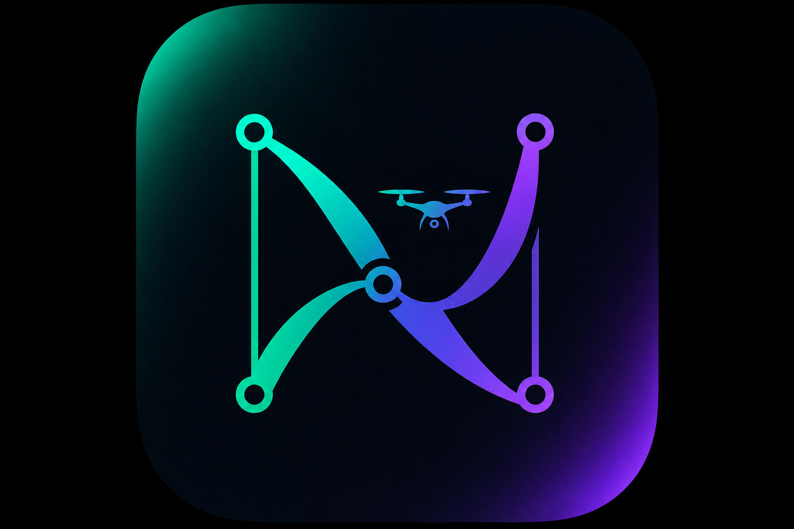
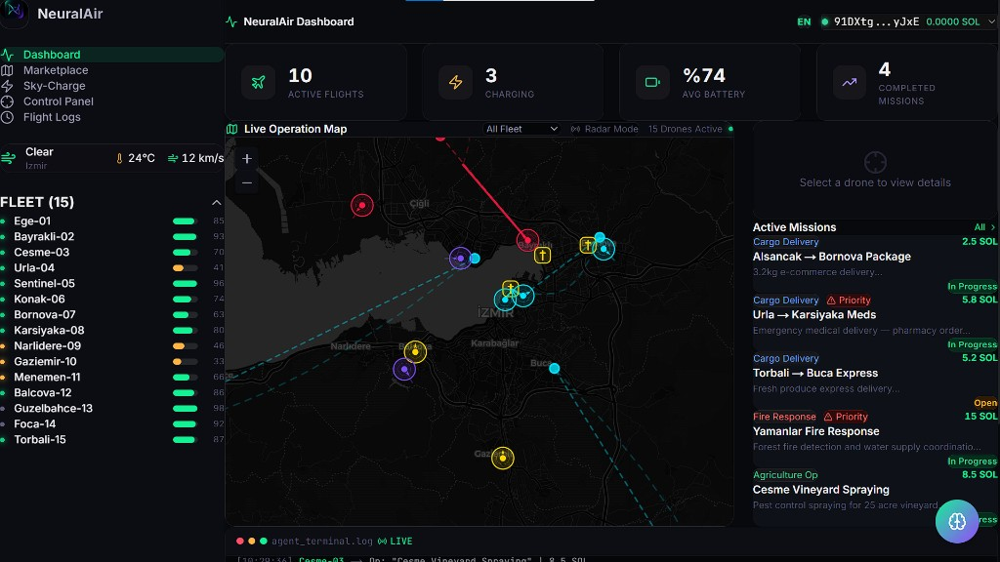
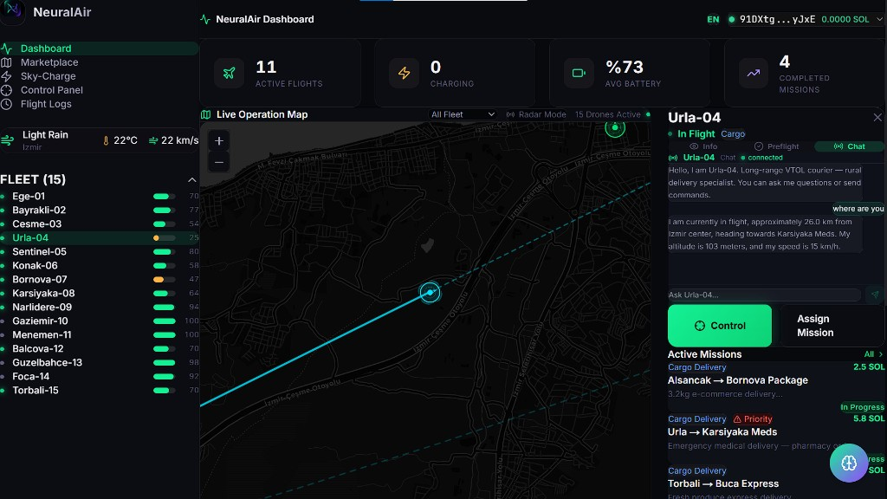
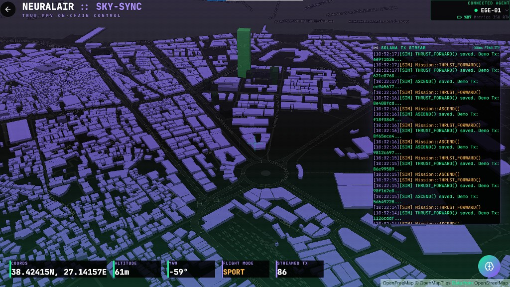
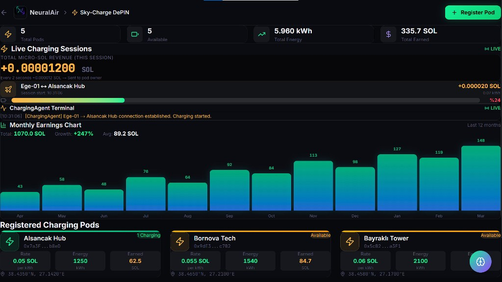

<div align="center">
  
  <h1>NeuralAir</h1>
  <p><strong>Decentralized Autonomous Aviation Network (DAAN) on Solana</strong> — open mission marketplace, live fleet intelligence, AI dispatch &amp; agents, and DePIN-style Sky-Charge economics.</p>
  <p>
    <a href="https://neuralair.vercel.app"></a>
    &nbsp;
    <a href="https://github.com/hsankc/NeuralAir"></a>
  </p>
  <p>
    
    
    
    
    
  </p>
</div>

---

## Overview

**NeuralAir** is a **product-grade hackathon build** that demonstrates how Solana can sit at the coordination layer for real-world drone operations: **missions**, **fleet telemetry**, **operator workflows**, and **charging infrastructure incentives**—without hiding behind abstract token narratives.

| Capability | What judges can click |
|------------|----------------------|
| **Open marketplace** | Post / browse missions (cargo, agriculture, fire, traffic) with wallet-aware UX on **Devnet** |
| **Live operations** | Interactive **MapLibre / Leaflet** map: drones, routes, filters, radar-style overlays |
| **AI coordination** | Natural-language **dispatcher** + streaming **Fleet / Charging / Emergency** agent reasoning (OpenAI with local fallback) |
| **DePIN slice** | **Sky-Charge** UI for distributed charging pods, energy & earnings storytelling |
| **Traceability** | **Flight logs** view for operational audit narrative |
| **Control surface** | **Manual control** page for pilot-style intervention story |

> **Simulation disclosure (important):** drone motion and some mission flows are **simulated** for a reliable jury demo. Wallet flows and UI are real where configured; the architecture is intentionally aligned with **MAVLink-class** integration paths for future field hardware.

---

## Screenshots

Gallery assets live in `docs/screenshots/`: **live UI** captures from the demo, plus **product graphics** (modules, flows, fleet reference hardware, edge architecture, stack ribbon).

| # | File | What it shows |
|---|------|----------------|
| 1 | `01-landing.png` | Landing hero, metrics strip, Solana / DePIN positioning |
| 2 | `02-dashboard.png` | Operations dashboard: KPIs, fleet map, missions, agent log |
| 3 | `03-live-operations.png` | Map + active missions + live agent terminal |
| 4 | `04-drone-ai-chat.png` | Fleet map with selected drone and per-unit AI chat |
| 5 | `05-control-sky-sync.png` | Control / digital twin view with on-chain TX stream |
| 6 | `06-sky-charge.png` | Sky-Charge DePIN: pods, sessions, earnings |
| 7 | `07-flight-logs.png` | Flight logs (on-chain narrative), filters, KPIs |
| 8 | `08-ai-dispatcher.png` | Natural-language AI dispatcher + structured dispatch JSON |
| 9 | `09-product-modules.png` | Seven modules on one protocol surface (SkyMap, market, Sky-Charge, AI, agents, control, logs) |
| 10 | `10-parallel-flows.png` | Three parallel flows: mission lifecycle, Sky-Charge economy, manual operator takeover |
| 11 | `11-fleet-hardware-categories.png` | Seven mission categories with reference airframes (MAVLink-class compatibility story) |
| 12 | `12-edge-hardware-architecture.png` | Edge node stack: Pixhawk / Jetson / connectivity / sensors / identity → Solana Devnet |
| 13 | `13-tech-stack.png` | Full stack overview: frontend, Web3, maps, backend, AI agents, hardware bridge |

<p align="center">
  
  
</p>
<p align="center">
  
  
</p>
<p align="center">
  
  
</p>
<p align="center">
  
  
</p>
<p align="center">
  
  
</p>
<p align="center">
  
  
</p>
<p align="center">
  
</p>

---

## Architecture (high level)

```text
Browser (Next.js App Router)
  ├── Wallet (Phantom) → Solana Devnet RPC
  ├── Maps (MapLibre GL / Leaflet / Turf)
  ├── AI Dispatcher + Drone chat → OpenAI API (optional) + rule-based fallback
  ├── Agent terminal (Fleet / Charging / Emergency)
  └── Supabase client (optional; offline-safe defaults for builds)
```

---

## Tech stack

| Layer | Technologies |
|-------|----------------|
| **App** | Next.js **16**, React **19**, TypeScript **5**, Tailwind CSS **4** |
| **Web3** | `@solana/web3.js`, Phantom, Devnet |
| **Maps** | MapLibre GL JS, Leaflet, Turf.js |
| **Data / realtime** | Supabase JS (optional) |
| **AI** | OpenAI **gpt-4o-mini** (optional) + local fallback prompts |

---

## Getting started

### Prerequisites

- **Node.js** 20+ (18+ may work; LTS recommended)
- **npm** (ships with Node)
- **Phantom** browser extension if you want wallet features (**Devnet** + a small Devnet SOL balance)

### Install & run

```bash
git clone https://github.com/hsankc/NeuralAir.git
cd NeuralAir
npm install
npm run dev
```

Open **http://localhost:3000** — landing, then use **Console** for the dashboard, **Marketplace**, **Sky-Charge**, **Control**, **Flight Logs** from the UI.

### Production build

```bash
npm run build
npm start
```

### Environment variables

Create **`.env.local`** in the project root (see `.env.example` if present):

```env
# Optional — AI dispatcher / drone chat
OPENAI_API_KEY=

# Optional — Supabase logging / realtime
NEXT_PUBLIC_SUPABASE_URL=
NEXT_PUBLIC_SUPABASE_ANON_KEY=

# Solana (defaults are fine for Devnet demo)
NEXT_PUBLIC_SOLANA_NETWORK=devnet
NEXT_PUBLIC_SOLANA_RPC=https://api.devnet.solana.com
```

The app is designed to **run without** OpenAI/Supabase keys for core UI and simulation paths.

---

## Repository layout (notable)

| Path | Role |
|------|------|
| `src/app/` | Routes: landing, dashboard, marketplace, sky-charge, control, flight-logs |
| `src/lib/hooks/useSimulation.ts` | Client-side fleet / mission simulation |
| `src/lib/ai/dispatcher.ts` | AI prompt + parsing + fallback |
| `src/lib/agents/` | Fleet, charging, emergency, user agents |
| `src/components/SkyMap.tsx` | Leaflet map layers (routes, scans, pods) |
| `public/neuralair-logo.png` | Brand / favicon asset |

---

## Hardware & field integration

For MAVLink, edge compute, and physical pod assumptions, add a **`HARDWARE.md`** guide at the repo root (common for hackathon handoff). The UI and simulation are structured to align with **MAVLink-class** telemetry integration when you extend the project.

---

## License & disclaimer

This repository is a **hackathon / demo prototype**. It is **not** production flight software. Do not use it to control real aircraft without certified systems, regulatory compliance, and professional safety review.

---

<div align="center">
  <sub>Built for the Solana ecosystem — NeuralAir · SkyAgent Protocol narrative</sub>
</div>
